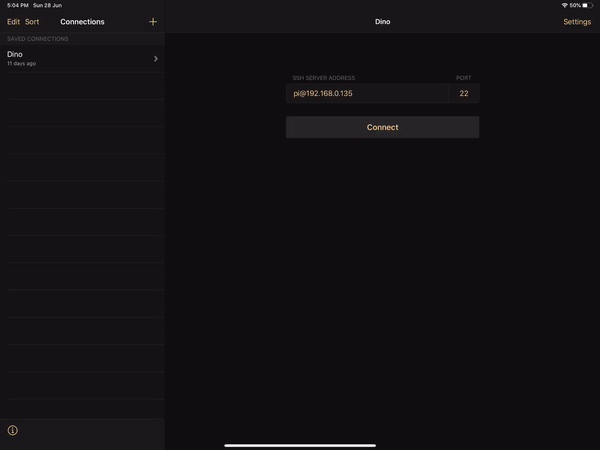
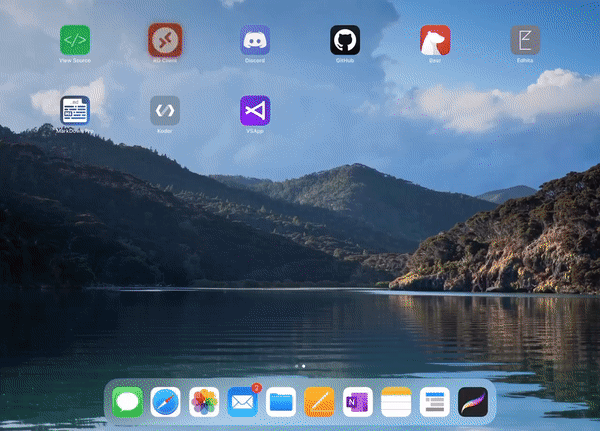
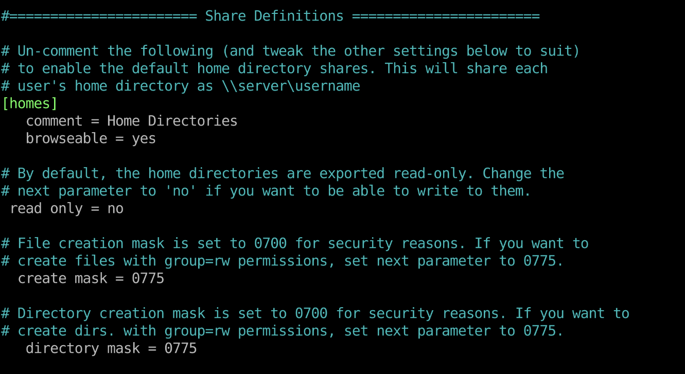

# Tutorial 

## Web development on the iPad

While there are online integrated development environments (IDE) out there (such as GitPod or Codesandbox), these still have some limitations on the iPad - the biggest one being the inability to copy and paste.

In this tutorial we'll be using the iPad to interface with a Raspberry Pi 4 running Code-OSS as the IDE. Code-OSS is the open-source code Microsoft's VSCode is based on, so it may look familiar to you!


We'll begin by setting up a Raspberry Pi headless (no monitor attached) to run Linux Ubuntu 20.04 with the LXDE desktop environment. We'll access our Raspberry Pi from the iPad through a combination of the Shelly terminal app, Microsoft's Remote Desktop app, and the Files app. 

## What you'll need: 
- A Raspberry Pi 4 with at least 4GB RAM
- A MicroSD card, minimum 16GB
- A MicroSD Card Reader for the computer
- A solid-state drive (SSD) to use as a default drive instead of the microSD card (optional, but highly recommended - see [here](https://www.maketecheasier.com/sd-card-vs-ssd/))
- A computer (Mac, Windows or Linux) with [Balena Etcher](https://www.balena.io/etcher/) installed
- Internet connectivity, either via ethernet cable or Wifi network
- The [Microsoft Remote Desktop](https://apps.apple.com/us/app/remote-desktop-mobile/id714464092#?platform=ipad) app installed on your iPad
- The [Shelly - SSH Client](https://apps.apple.com/us/app/shelly-ssh-client/id989642999) app installed on your iPad (free trial of the Pro features)
- A bluetooth keyboard and mouse for your iPad (optional)


## Installing Linux 

In this step we will install Ubuntu 20.04 Server to the Raspberry Pi

### Preparing the SD card:
1. Download the Ubuntu 20.04 image from the [Ubuntu](https://ubuntu.com/download/raspberry-pi) website onto your computer.
2. Insert the MicroSD and open Balena Etcher.
3. Click on **Select Image**, and use the browser to navigate to the image you just downloaded. Click on **Select Target** and select the MicroSD, then click Flash.

If you are using a solid-state drive, flash the same image to the solid-state drive as well. 

### Connecting the Pi to the internet:
There are two ways to connect the Pi to the internet; directly to the router with an ethernet cable, or via WIFI. 

If you are connecting your Raspberry Pi to the network via ethernet cable, you can skip to the [next](#booting-up-the-raspberry-pi) step. 

To enable the Raspberry Pi to connect to the WIFI network on startup, we will need to add some additional information to the configuration files. 
1. In a file explorer, navigate to the SD card (and solid-state drive, if using) you just flashed the image onto. 
2. Find the "system-boot" partition, and then open the ```network-config``` file. 
3. Find the ```wifis``` section, and remove the hash at the beginning. Change ```<wifi network name>``` to your wifi network name, and ```<wifi password>``` to your wifi password

 ````
wifis:
  wlan0:
  dhcp4: true
  optional: true
  access-points:
    <wifi network name>:
      password: "<wifi password>"
````

>:exclamation: **Important** If your wifi network has spaces in its name, use quotation marks around the network name.


4. Save the file, and remove the SD Card (and SSD drive) from your computer. 

### Booting up the Raspberry Pi

It's time to power up the Pi! Insert the microSD card, plug in the solid-state drive (if using) and plug in the Pi with a USB-C power cable. It takes a minute or so before Ubuntu boots and the Pi connects to the network. 

### Accessing the Raspberry Pi

We will need to find the IP address of the Raspberry Pi before we can access it. For more information on how to find the IP addresses of devices on your network, see this helpful [how-to article](https://helpdeskgeek.com/how-to/determine-computers-connected-to-wireless-network/). 

?> **Tip** It is a good idea to ensure that your router assigns a static IP address to your Raspberry Pi, so you don't have to look up the IP address every time the Pi reconnects to the network. For a great explanation on how to assign static IP addresses, see [this article](https://au.pcmag.com/news/65062/how-to-set-up-a-static-ip-address)


1. Open the Shelly app. On the left pane, next to Connections, click on the **+**
2. On the main pane in the SSH Server Address field, type ubuntu@xxx.xxx.x.xxx, replacing the x's with your Pi's IP address. 
3. Leave the port at 22, and press **Connect**.
4. When you are asked to confirm the connection, type yes, and then press Return (<kbd>&#8629;</kbd>)  on your keyboard. 
5. The default password is 'ubuntu'. You will be prompted to change this the first time you connect. The cursor will not move as you type the passwords. 




?> **Tip** To save your log in credentials, click on **Settings** on the right side of the Shelly app. In the username field, type ```ubuntu``` and in the password field, enter the password you set up during the previous step. Now Shelly will automatically use those credentials to log you in every time you open the connection.

> :exclamation: **Important**
> You must enable location settings to run in the background, otherwise Shelly will close the connection any time you are not in the app.


When you start a new connection, you should see:
````
ubuntu@ubuntu:~$
````
This is the command line. The ```~``` means you are in  the home directory. For more information on the command line and how it works, this [excellent article](#) is a good reference. 


>:exclamation: **Important** 
>
> Before proceeding further:
>
>It is important if you are using an SSD to ensure the Raspberry Pi will use the SSD instead of the microSD when it boots. 
>
> When you start a new connection to the Pi, there is a line in the terminal that says ```Usage of /:```. This shows how much space is available on the drive. Use this information to see which drive it has booted into.
>
> By default, the Pi boots from a partition called "writeable". However, if you have both the SD card and the SSD connected and they both have "writeable" partitions, the pi will boot into whichever volume it picks up first. To prevent this from happening, enter the following into the command line:
>
> ````bash
> lsblk -o +LABEL
> ````
>
> You should see two disk devices: sda (the SSD) and mmcblk0 (the SD card). Under the LABEL column, you will see both have partitions called writeable.
>
> To change the SD card partition name, type the following into the command line:
>
> ````bash
>sudo e2label /dev/mmcblk0p2 NEWNAME
>```` 
>
>In this example, NEWNAME is what you want to call the partition. I named mine SDWriteable, but any name will do. 
>Run ```lsblk -o +LABEL``` again, and check that the new LABEL of the SD card is whatever you changed it to. 
>
>Run ```sudo reboot``` and check that the Pi is using the SSD. If the first time you connected to the Pi was when you were accessing Ubuntu on the SD card, you will need to reset the default 'ubuntu' password when you access Ubuntu on the SSD for the first time. 


### Installing a desktop environment

Our Raspberry Pi is up and running, with Ubuntu Server as the operating system - but we want to have a graphical interface so that we can run Code-OSS remotely from the iPad. 

In the Shelly app, use the existing connection or start a new one, using the details you entered before. 

First, we need to update Ubuntu, to make sure everything is up to date. In the command line, copy and paste, or type the following:
````
sudo apt update  && sudo apt upgrade
````
This might take a few minutes. The process is complete when you see ```ubuntu@ubuntu:~$``` with a cursor again.

The Raspberry Pi is a great little computer, however some of the more resource intensive GUIs (graphical user interfaces) will slow it down too much. The best option I've found for optimising graphics, without being too resource intensive, is the LXDE desktop. 

On the command line, type the following:
````
sudo apt install lxde
````
When prompted, choose GDM3.

When the install is complete, type the following to start the desktop:
````
sudo gdm3
````

## Using the Pi as a Remote Desktop

We now have Ubuntu running the LXDE desktop. But we still can't see it!

First, we need to install xrdp on the Pi.

On the command line:
````
sudo apt install xrdp
````

Once we have xrdp installed, open the Microsoft Remote Desktop app (RD Client to set up a new Remoter Desktop:

1. On the right side, click the **+**, then **Add PC**. A dialog will open. 
2. Click on **PC Name** and enter the Pi's IP address. 
3. Click on **User Account**, and enter your login credentials. This should be 'ubuntu' and the password you selected when you first connected to the Raspberry Pi via the Shelly app. 
4. Go back, and then click **Save** in the upper right hand corner of the dialog. 
5. You should see a new PC in the uppermost left corner. Click on this PC to open the Remote Desktop. 



Welcome to your new Linux desktop!

## Installing useful tools

LXDE is a very bare-bones desktop, with very few additional programs installed. This is great for the Raspberry Pi, since it's extremely lightweight. However, to use this as our web development machine we will need to install a few things first!

### Code-OSS

To install Code-OSS, run the following on the command line. You can do this via the Remote Desktop, in the Terminal application that comes with LXDE, or via Shelly.

````
sudo -s 
. <( wget -O - https://code.headmelted.com/installers/apt.sh )
````

?> **Tip** The ```sudo -s``` command switches the entire terminal session into "superuser", or root, mode. In general, you should be careful using this command, as some things should not be done in superuser mode. 


> :exclamation: **Note**
> After install, you may get a warning message about a missing GPG key when running the ```apt update``` command, something like: 
> ````
> The following signatures couldn't be verified because the public key is not available: 
> NO_PUBKEY 2696BFC88BAF9A6F
> ````
> To solve this issue, run the following on the command line, changing the 8 digit '8BAF9A6F' code to the last 8 digits of the key in the actual error message you received:
>
> ````
> sudo apt-key adv --keyserver hkp://keyserver.ubuntu.com --recv-keys 8BAF9A6F
> ````


### Samba

- A Samba server allows you to access the files on your Raspberry Pi through the Files app on your iPad.

To install Samba:

````
sudo apt install samba
````
We'll change the access permissions for the home folder. This way we can access all our files from the iPad. 
````
sudo chmod 777 /home
````
We'll add a user to Samba, by using:
````
sudo smbpasswd -a USERNAME
````
In this example, you would change USERNAME to the actual username you want to add. 

You will be prompted to enter a password.

Next, we'll edit the Samba configuration file:

````
sudo nano /etc/samba/smb.conf
````


1. Use the cursor and arrow keys to go down to ``` Share Definitions```.
2. Change the file by deleting the ```#``` in front of ```[homes]```. 
3. Delete the semicolon in front of ```Comment``` and ```Browsable```. Change the answer to ```Browsable``` from no to yes.
4. Delete the the semicolon in front of ```read only```, and change the no to a yes. 
5. Delete the semicolon in front of ```create mask``` and ``` directory mask```, and change both numbers to 0775.
6. When you're done editing the file, press Control (<kbd>&#8963;</kbd>) + <kbd>x</kbd> to exit. Press <kbd>Y</kbd> at the prompt, and then press  Return (<kbd>&#8629;</kbd>) to save the file. 

Once you've finished editing the file, restart the server:
````
systemctl restart smbd
````

To access the files in your home folder from the iPad, open the files app. On the upper left hand side, press the More Options icon (circle with three dots). Select ```Connect to Server```. In the server field, type in the Pi's IP address. Tick Registered User, and enter the username and password you set in Samba. Select Next, and you should see your Pi's home folder. 

Because we set the permissions for the folder to be both read and write, you can create, delete and edit files and folders on your Pi directly from your iPad. 


### Node.js and npm (node package manager).
- Node.js is a cross-platform javascript environment, used to build back-end and front-end applications.
- npm is used to install a variety of static-site generators, themes, plugins, and much more.

To install nodejs and npm:

````
sudo apt update
sudo apt install nodejs npm
````

The apt command may not install the version you want. To get version 14 from Nodesource instead:

````
curl -sL https://deb.nodesource.com/setup_14.x | sudo -E bash -
sudo apt install nodejs
````
To install a different version, replace the 14.x in the above command with the version you want, for example, 12.x.

